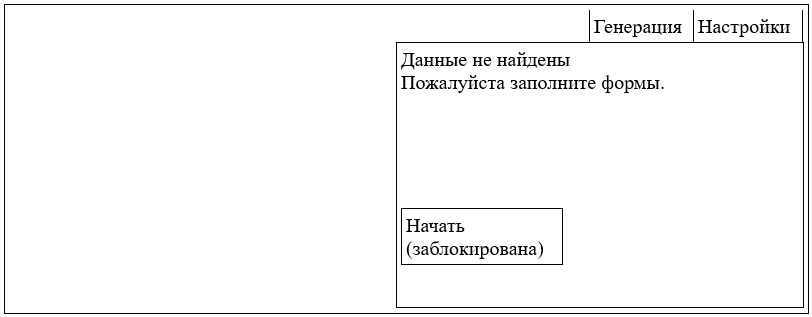
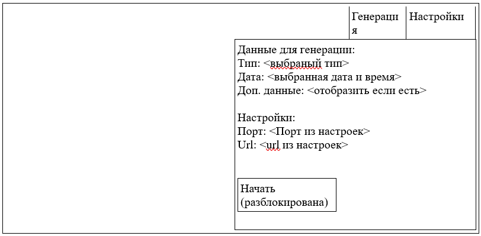
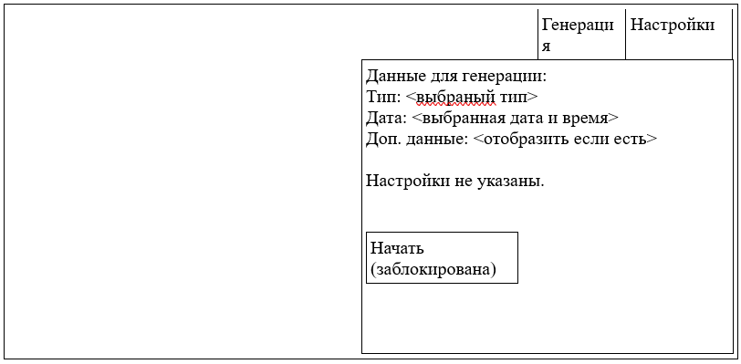
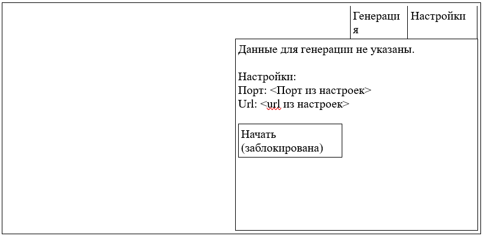

# VideoProject
## _Необходимо сделать веб-приложение с использованием Angular_

В данном веб приложении необходимо создать страницу входа, в которой должно быть две вкладки: «Генерация» и «Настройки», вкладки необходимо реализовать в виде двух компонентов.

На первой вкладке поле «тип» с выпадающим списком (заполнить можно любыми значениями), поле «время» с выбором даты и времени, и поле «доп. данные» и кнопка «Сохранить» при нажатии на которую должен быть открыт родительский компонент. Все поля кроме «доп. данных» должны быть обязательны к заполнению. Дочерний компонент должен через Output отправить родительскому информацию об отправке данных (по сути все введенные данные должны отобразиться в родительском компоненте).

На второй вкладке необходимы поля «порт», который принимает только числовые значения и «url» в котором можно использовать только латиницу, а также кнопка «сохранить» при нажатии которой введенные данные будут сохранены (файл, localStorage или что-то еще).
 
При реализации форм использовать ReactiveForms.

Для навигации по двум страницам необходимо использовать Angular Route

При обозначении функций, констант и переменных использовать camelCase. 

В качестве UI библиотеки компонентов можно взять любую из:
- Angular-Material
- Nebular
- NGPrime
- TaigaUI

Систему можно спроектировать, как и на одного пользователя, так и на многих, по желанию. Форму разрешается дополнять и изменять, главное, чтобы суть задачи оставалась неизменной.

В задаче необходимо показать свои навыки UX. Не забывать оповещать пользователя о состоянии системы (неправильная заполненная форма, идет загрузка и тд). Использование асинхронного кода будет плюсом.

Родительский компонент (макеты исходя из состояния):

1. Если данные отсутствуют

2. Если все данные в наличии

3. Если отсутствуют настройки

4. Если отсутствуют данные для генерации
